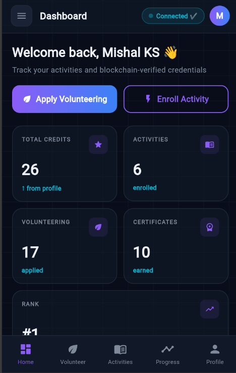
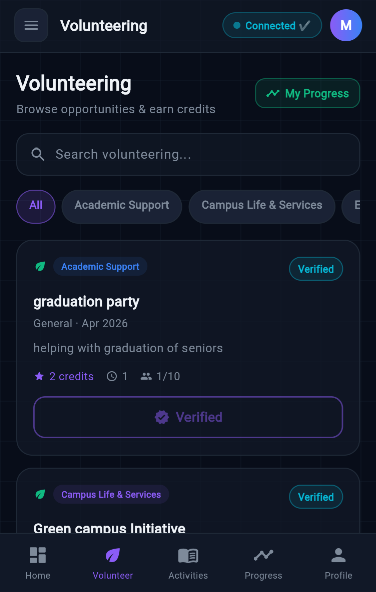
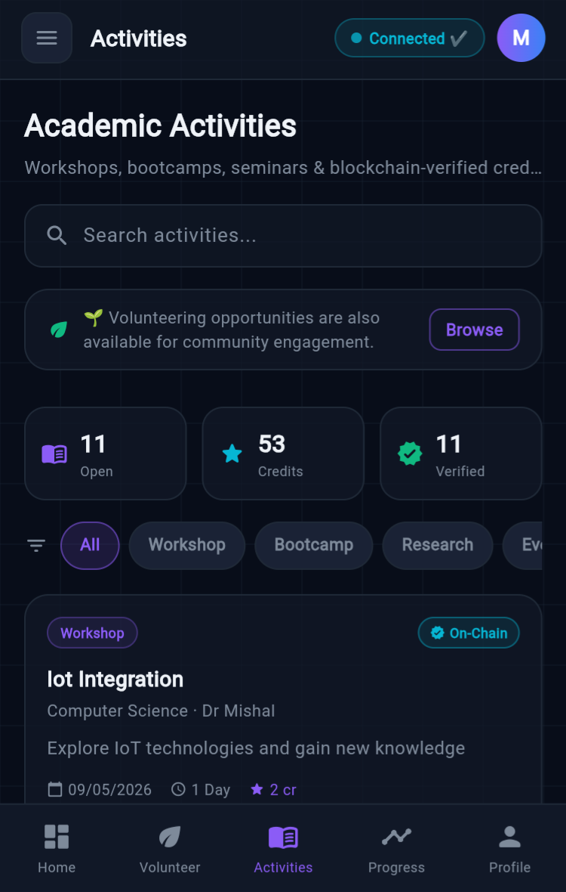
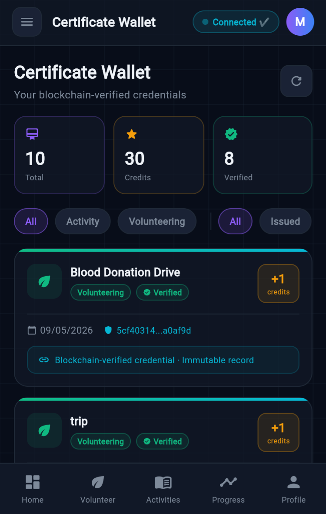
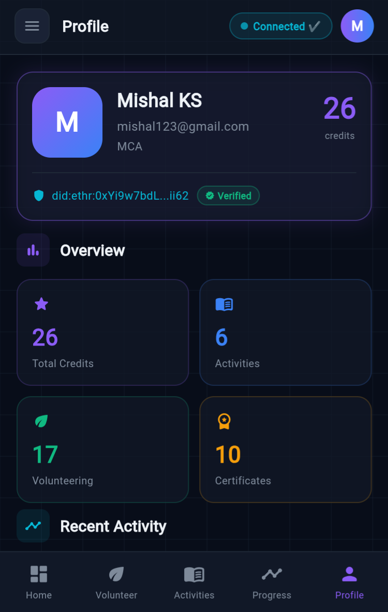
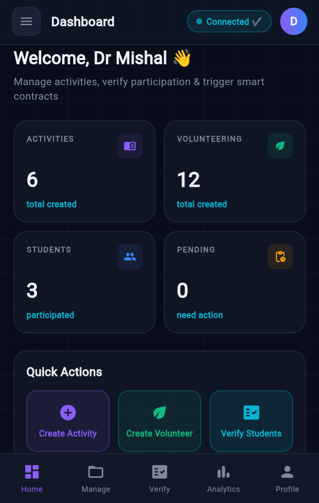
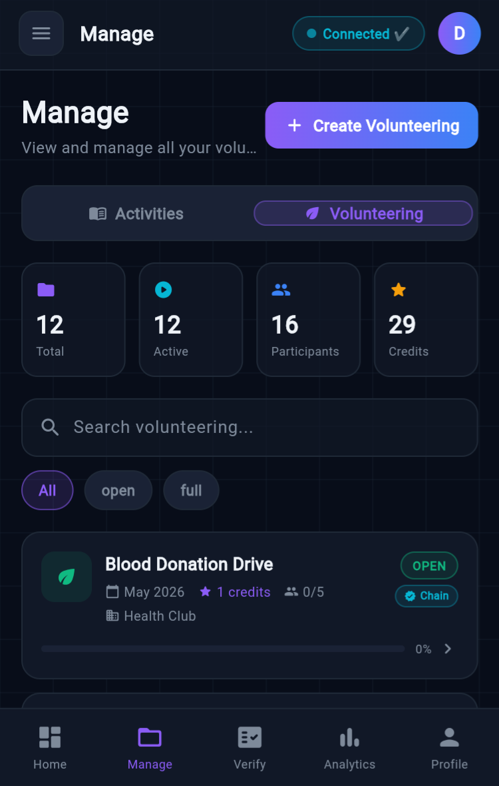
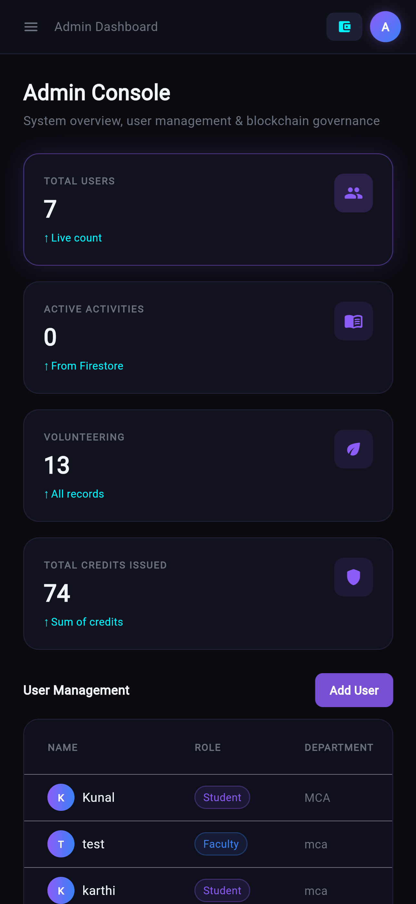
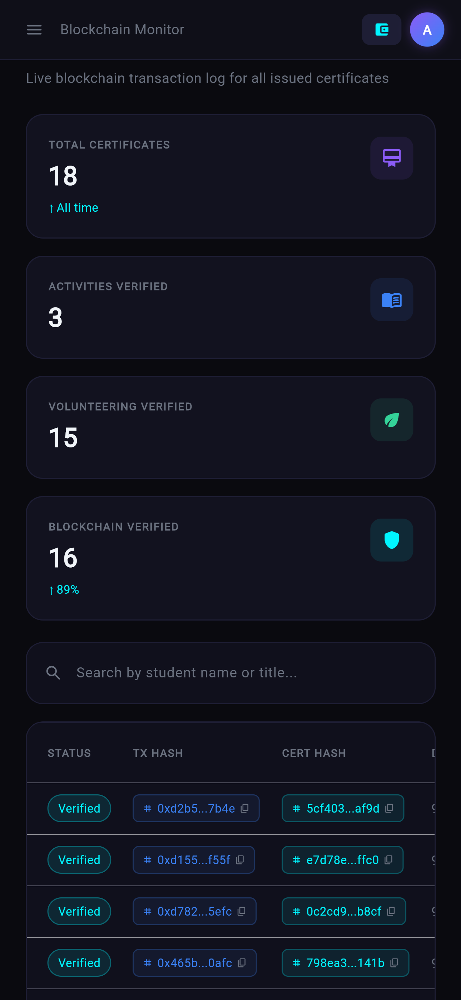

# 🎓 UniTrack – Academic Activity & Credit Management Platform

UniTrack is a modern Flutter + Firebase based academic activity and credit management platform designed for universities and colleges.

The system enables:

- 👨‍🎓 Students to enroll in activities, volunteering, and track credits
- 👨‍🏫 Faculty to manage activities and verify participation
- 🛡️ Admins to monitor the entire ecosystem

The application includes real-time Firestore integration, role-based authentication, analytics dashboards, and blockchain-ready certificate verification architecture.

---

# ✨ Features

## 👨‍🎓 Student Features

- Activity enrollment
- Volunteering applications
- Credit tracking
- Certificate management
- Progress analytics
- Personalized recommendations
- Responsive dashboard

---

## 👨‍🏫 Faculty Features

- Create and manage activities
- Create volunteering opportunities
- Verify student participation
- Approve/reject requests
- Analytics dashboard
- Manage students and credits

---

## 🛡️ Admin Features

- Platform-wide monitoring
- User analytics
- Activity tracking
- Blockchain monitoring
- Logs and statistics dashboard

---

# 🔥 Tech Stack

| Technology              | Purpose                  |
| ----------------------- | ------------------------ |
| Flutter                 | Frontend Framework       |
| Dart                    | Programming Language     |
| Firebase Authentication | User Authentication      |
| Cloud Firestore         | Real-time Database       |
| Firebase Storage        | File Storage             |
| Material UI             | UI Components            |
| Blockchain Integration  | Certificate Verification |

---

# 🏗️ System Architecture

- Role-based authentication
- Firestore-driven backend
- Modular dashboard architecture
- Real-time synchronization
- Secure Firebase rules
- Responsive mobile-first UI

---

# 🔐 Security Features

- Firebase Authentication
- Role-based access control
- Firestore Security Rules
- Restricted Firebase API keys
- Protected database access

---

# 📱 Application Screenshots

## 👨‍🎓 Student Dashboard



---

## 🌱 Volunteering Module



---

## 📚 Activities Module



---

## 🏅 Certificates Module



---

## 👤 Student Profile



---

## 👨‍🏫 Faculty Dashboard



---

## 🛠️ Faculty Management



---

## 🛡️ Admin Dashboard



---

## ⛓️ Blockchain Monitor



---

# 🚀 Getting Started

## 1️⃣ Clone Repository

```bash
git clone https://github.com/mishal4583/UniTrack-Academic-Platform.git
```

---

## 2️⃣ Install Dependencies

```bash
flutter pub get
```

---

## 3️⃣ Firebase Setup

Add your own Firebase configuration files:

### Android

```text
android/app/google-services.json
```

### iOS

```text
ios/Runner/GoogleService-Info.plist
```

---

## 4️⃣ Run Application

```bash
flutter run
```

---

# 📂 Project Structure

```text
lib/
 ├── screens/
 │    ├── auth/
 │    ├── student/
 │    ├── faculty/
 │    └── admin/
 ├── services/
 ├── widgets/
 └── main.dart

assets/
 └── screenshots/
```

---

# 🔮 Future Enhancements

- AI-powered recommendation engine
- Advanced analytics dashboard
- Push notifications
- Blockchain certificate verification
- Attendance automation
- Cloud Functions backend
- Multi-platform deployment

---

# 👨‍💻 Contributors

- Mishal KS

---

# ⭐ Support

If you like this project, consider giving it a ⭐ on GitHub.
